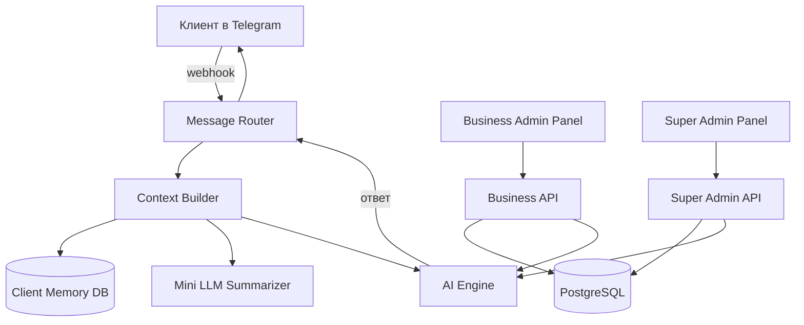

# AI Sales Manager — Architecture

> Multi-tenant B2B SaaS платформа. AI-агенты работают как менеджеры по продажам и букинг-ассистенты через мессенджеры (Telegram → Instagram → WhatsApp → ...).

---

## Overview

```
Клиент пишет в Telegram/Instagram
       ↓
AI-агент отвечает от имени бизнеса
       ↓
Бизнес видит аналитику, чаты, заказы
       ↓
Генеральный администратор управляет всем
```

---

## Tech Stack

| Слой | Технология | Зачем |
|---|---|---|
| Frontend | Next.js 14 (App Router) | SSR, роутинг, серверные компоненты |
| UI | shadcn/ui + Tailwind | Swiss minimalism, кастомизация |
| Backend | Node.js + Express / Fastify | API сервер |
| БД | PostgreSQL | Основное хранилище |
| ORM | Prisma | Типобезопасность, миграции |
| AI | OpenAI / Anthropic / любой через API | Подключается динамически |
| Summarizer | отдельная маленькая LLM | Суммаризация прошлых чатов |
| Мессенджеры | Telegram Bot API (webhook) | Старт, потом Instagram/WA |
| Auth | NextAuth / JWT | Роли: super-admin, business-admin |
| Очереди | BullMQ + Redis | Обработка сообщений, уведомления |
| Хранилище файлов | S3 / Cloudflare R2 | Фото продуктов, аватарки |
| Деплой | Docker + Railway / VPS | Контейнеризация |

---

## Roles & Access

```
super-admin (Генеральный)
    └── business-admin (Бизнес)
            └── AI-агент (бот, не человек)
                    └── client (клиент в мессенджере)
```

| Роль | Доступ |
|---|---|
| `super-admin` | Всё. Управляет бизнесами, AI, тарифами, глобальными настройками |
| `business-admin` | Только свой бизнес. Каналы, аналитика, чаты, продукты / букинг |
| `client` | Только мессенджер. Пишет боту |

---

## System Design (Mermaid)



---

## Module Breakdown

### 1. Landing Page (Публичный сайт)

- Реклама платформы
- Swiss minimalism дизайн ......
- CTA → регистрация / демо
- ......

---

### 2. Super Admin Panel

**Доступ:** только генеральный директор

#### 2.1 Dashboard / Аналитика
- Общая: токены использованы (в $), активные бизнесы, активные AI
- По каждому бизнесу: какой AI подключён, расход токенов, активность
- Фильтры по периоду

#### 2.2 Управление бизнесами
- Список всех бизнесов
- Создание нового бизнеса:
  - Название, описание
  - Тип: `sales` | `booking`
  - Какой AI подключить
- Редактирование любого бизнеса
- Установка логина/пароля для business-admin
- Управление видимостью аналитики (что видит бизнес, что скрыто)

#### 2.3 AI Management
- Список подключённых AI (OpenAI, Anthropic, и тд)
- Добавление нового AI через API ключ
- Статус каждого AI (активен / ошибка)
- Глобальный системный промт — добавляется к каждому запросу автоматически
- Назначение AI на бизнесы

#### 2.4 Чаты (глобально)
- Все чаты всех бизнесов
- Фильтры: по бизнесу, по дате, по пользователю, по каналу

#### 2.5 Уведомления
- Отправить уведомление конкретному бизнесу

#### 2.6 Тарифные планы ......
- Создание планов (лимит бизнесов, токенов, каналов)
- Назначение плана бизнесу
- ......

#### 2.7 Настройки аккаунта
- Аватарка, никнейм (видны бизнесам при уведомлениях)
- Смена логина / пароля
- Тёмная / светлая тема

---

### 3. Business Admin Panel

**Доступ:** владелец бизнеса (логин/пароль от super-admin)

#### 3.1 Dashboard / Аналитика
- Активность бота: сообщений за период, конверсий
- Для `booking`: количество записей, загруженность слотов
- Для `sales`: продажи, выручка, топ продуктов
- Фильтры по дате, каналу
- Что именно показывать — управляется с super-admin

#### 3.2 Каналы / Соц сети
- Подключение Telegram (бот токен или бизнес-аккаунт)
- ......Instagram, WhatsApp, Facebook — будет добавлено позже
- Статус каждого канала (активен / отключён / ошибка)
- Пауза бота на конкретном канале

#### 3.3 AI Настройки
- Контекст бизнеса для AI:
  - Название бизнеса
  - Описание (чем занимается)
  - Правила поведения бота
  - Часы работы, выходные дни
- Этот контекст автоматически идёт в каждый промт

#### 3.4 Чаты
- История всех чатов с клиентами
- Что написал клиент → что ответил AI
- Фильтры по каналу, дате, пользователю

#### 3.5 Букинг (только для типа `booking`)

**Календарь:**
- Большой визуальный календарь
- Занятые слоты отображаются закрашенными (например 09:00–11:00)
- Клиент и AI не могут взять одно и то же время (синхронизация)

**Настройки слотов:**
- Длительность одного слота (минут)
- Перерыв между клиентами (минут)
- Максимум клиентов за один слот
- Типы специалистов (например: терапевт, хирург) — у каждого свой независимый календарь

**Очередь заказов:**
- Список ожидающих букингов
- Статус каждого: ожидает / подтверждён / отменён

#### 3.6 Продажи (только для типа `sales`)

**Каталог продуктов:**
- Добавление продукта: название, описание, количество / граммовка, фото
- Редактирование / удаление

**Заказы:**
- Таблица: продукт, количество, кому (имя / ник), когда, адрес, сумма
- Фильтры и сортировка
- Клиент тоже может создать заказ напрямую (не через AI) — синхронизация

**Лимиты:**
- Минимальное и максимальное количество продаж на товар (из настроек)

#### 3.7 Настройки бизнеса
- Общие данные бизнеса
- Пауза / возобновление всего бота
- ......

---

### 4. AI Engine

Ядро системы. Обрабатывает каждое входящее сообщение.

#### Промт сборка (порядок важен):

```
[1] Глобальный промт (от super-admin)
[2] Контекст бизнеса (от business-admin)
[3] Суммаризация прошлого чата с этим клиентом (если есть)
[4] Последние N сообщений текущего диалога
[5] Новое сообщение клиента
```

#### Логика памяти клиента:

```
Первый раз пишет?
  → [глобальный] + [бизнес] + [новое сообщение]

Тот же пользователь, тот же сеанс (живой диалог)?
  → [глобальный] + [бизнес] + [последние N сообщений] + [новое]

Тот же пользователь, но прошло 24ч+ (новый сеанс)?
  → Summarizer запускается асинхронно после окончания сеанса
  → Сохраняет в Client.summary: "Алексей, купил протеин 2кг,
     интересовался доставкой, общается коротко"
  → [глобальный] + [бизнес] + [summary] + [новое]
  → Полная история не грузится → экономия токенов ✓
```

**Триггер summarizer:** 24 часа без новых сообщений от клиента = сеанс закрыт → запускается суммаризация.

#### Динамический выбор AI:
- Каждый бизнес имеет назначенный AI
- При запросе берётся API ключ именно этого AI
- Легко переключить без изменения кода

---

### 5. Message Router

Точка входа всех сообщений из мессенджеров.

```
Webhook (Telegram) → Message Router
                          ↓
                   Найти бизнес по bot_id
                          ↓
                   Найти / создать клиента
                          ↓
                   Context Builder → AI Engine
                          ↓
                   Отправить ответ обратно в мессенджер
                          ↓
                   Сохранить сообщение в БД
```

---

## Database Schema

### Основные таблицы

```prisma
model Business {
  id          String   @id
  name        String
  description String
  type        BusinessType  // sales | booking
  aiModelId   String
  adminLogin  String   @unique
  adminPassHash String
  isActive    Boolean  @default(true)
  settings    Json     // часы работы, правила и тд
  createdAt   DateTime

  channels    Channel[]
  clients     Client[]
  products    Product[]   // только sales
  bookings    Booking[]   // только booking
  chats       Chat[]
}

model Channel {
  id          String   @id
  businessId  String
  type        ChannelType  // telegram | instagram | ...
  token       String
  status      ChannelStatus  // active | paused | error
  business    Business @relation(...)
}

model Client {
  id          String   @id
  businessId  String
  externalId  String   // telegram user id / instagram id
  channel     ChannelType
  username    String?
  summary     String?  // суммаризация прошлых чатов
  lastSeenAt  DateTime
  business    Business @relation(...)
  chats       Chat[]
}

model Chat {
  id          String   @id
  businessId  String
  clientId    String
  role        MessageRole  // user | assistant
  content     String
  createdAt   DateTime
  business    Business @relation(...)
  client      Client   @relation(...)
}

model AIModel {
  id          String   @id
  name        String   // "GPT-4o", "Claude 3.5" и тд
  provider    String   // openai | anthropic | ...
  apiKey      String   // зашифровано
  status      AIStatus // active | error
  businesses  Business[]
}

model Product {
  id          String   @id
  businessId  String
  name        String
  description String?
  unit        String?  // граммы, штуки и тд
  photoUrl    String?
  minSales    Int?
  maxSales    Int?
  business    Business @relation(...)
  orders      Order[]
}

model Order {
  id          String   @id
  businessId  String
  productId   String
  clientName  String
  clientContact String
  address     String?
  quantity    Int
  amount      Decimal
  createdAt   DateTime
  source      OrderSource  // ai | manual
  product     Product @relation(...)
}

model BookingSlot {
  id           String   @id
  businessId   String
  specialistId String?  // если есть типы специалистов
  startTime    DateTime
  endTime      DateTime
  maxClients   Int
  breakMinutes Int
  clientId     String?
  status       SlotStatus  // available | booked | blocked
  source       BookingSource  // ai | manual
  business     Business @relation(...)
}

model Specialist {
  id          String   @id
  businessId  String
  name        String
  type        String   // "терапевт", "хирург" и тд
  slots       BookingSlot[]
}

model Plan {
  id            String   @id
  name          String
  maxBusinesses Int
  maxTokensUSD  Decimal
  maxChannels   Int
  price         Decimal
  // ......
}
```

---

## API Contracts

### Super Admin API

```
POST   /api/super/businesses          — создать бизнес
GET    /api/super/businesses          — все бизнесы
PATCH  /api/super/businesses/:id      — редактировать
POST   /api/super/ai-models           — добавить AI
GET    /api/super/analytics           — глобальная аналитика
POST   /api/super/notify/:businessId  — уведомление бизнесу
GET    /api/super/chats               — все чаты (с фильтрами)
```

### Business API

```
GET    /api/business/analytics        — аналитика бизнеса
GET    /api/business/chats            — чаты бизнеса
POST   /api/business/channels         — добавить канал
PATCH  /api/business/settings         — настройки AI контекста
GET    /api/business/bookings         — список букингов
POST   /api/business/bookings         — создать вручную
GET    /api/business/slots            — слоты календаря
POST   /api/business/products         — добавить продукт
GET    /api/business/orders           — заказы
```

### Webhook (Мессенджеры)

```
POST   /webhook/telegram/:botToken    — входящие сообщения Telegram
POST   /webhook/instagram/:accountId  — ...... (будет позже)
```

---

## Data Flow — Сообщение клиента

```
1. Клиент пишет в Telegram
2. Telegram шлёт webhook → /webhook/telegram/:token
3. Message Router определяет бизнес по токену
4. Ищет клиента в БД по telegram_user_id
5. Если клиент новый → создаёт запись
6. Context Builder собирает промт:
   - Глобальный промт (super-admin)
   - Контекст бизнеса (business-admin)
   - Саммари клиента (если есть)
   - Последние 10 сообщений диалога
   - Новое сообщение
7. AI Engine отправляет промт в нужный AI API
8. Получает ответ
9. Message Router отправляет ответ клиенту в Telegram
10. Оба сообщения (клиент + AI) сохраняются в Chat
11. Async: если диалог длинный → Mini LLM суммаризирует → обновляет Client.summary
```

---

## Scalability & Flexibility

### Принципы архитектуры

- **Adapter pattern** для мессенджеров — добавить Instagram = написать один адаптер, остальное не трогать
- **Adapter pattern** для AI провайдеров — добавить новый AI = написать один адаптер
- **Тип бизнеса** (`sales` / `booking`) управляет только UI и набором модулей, ядро одно
- **Feature flags** — включать/выключать функции без деплоя
- **Очереди (BullMQ)** — сообщения обрабатываются асинхронно, не блокируют друг друга

### Порядок разработки (рекомендуемый)

```
Phase 1: Telegram + Sales  (MVP)
Phase 2: Booking модуль
Phase 3: Instagram канал
Phase 4: WhatsApp канал
Phase 5: Тарифные планы
Phase 6: ......
```

---

## Production Hardening

### MVP — реализовать с первого дня

#### 🔐 Tenant Isolation
- Все запросы проходят через `businessId` middleware — без исключений
- На уровне БД: Row-Level Security (PostgreSQL RLS)
- Ни один запрос не уходит в БД без фильтра `businessId`

#### 🔑 Безопасность API ключей
- Шифровать AES-256 перед записью в БД
- Ключи живут только на backend, никогда не уходят на frontend
- Не логировать ключи нигде
- Доступ только через secure service layer

#### 📅 Booking Race Condition
- `SELECT FOR UPDATE` при резервации слота — обязательно
- Транзакция: проверить доступность → заблокировать → записать

#### 🛠 AI через Tools (Function Calling)
- AI не "угадывает" действия через текст, а вызывает функции
- Обязательные tools с первого дня:
  - `create_order(productId, quantity, clientInfo)`
  - `book_slot(slotId, clientInfo)`
  - `check_availability(date, specialistId?)`
- Backend выполняет функцию → возвращает результат AI → AI отвечает клиенту

#### ⚡ Базовый Rate Limiting
- Лимит на клиента: не чаще 1 сообщения в 2 сек
- Anti-loop: бот не отвечает сам себе

#### 🔄 Retry + Timeout для AI
- Exponential backoff при ошибке AI (3 попытки)
- Timeout на запрос к AI (например 30 сек)
- При неудаче — вежливый ответ пользователю вместо тишины

#### 📊 Structured Logs
- Каждый запрос логируется: `businessId`, `clientId`, `latency`, `tokens`, `error`
- Формат JSON — легко парсить и фильтровать

#### 🔁 Idempotency + Дедупликация событий
- Telegram может прислать один webhook дважды — без защиты заказ создастся дважды
- Таблица `processed_events(id, key, createdAt)` с TTL 48ч
- Перед любой обработкой: `if (already_processed(message_id)) skip`
- `idempotency_key` = `message_id` из Telegram (или аналог из других каналов)
- Покрывает: webhook повторы, BullMQ retry, network лаги

#### 🔢 Версионирование API
- Все эндпоинты с первого дня: `/api/v1/...`
- Позволяет вносить breaking changes без поломки клиентов

#### 💰 Billing Enforcement (Hard Limits)
- Middleware на каждый AI запрос: проверить лимит токенов → если превышен → заблокировать
- Hard limits: токены/месяц, количество каналов, количество бизнесов на плане
- Soft limits: уведомление бизнесу при 80% использования
- Без этого один бизнес может сжечь весь бюджет

---

### Phase 2 — после первых реальных пользователей

#### ⚡ Полноценный Rate Limiting
- Лимит токенов на бизнес (день / месяц)
- CAPTCHA / блокировка при подозрении на спам

#### 🧠 Memory Versioning
- Хранить: `summary` + последние N сообщений вместе
- Периодически пересоздавать summary (не терять контекст)
- Versioning: обновление summary без потери предыдущей версии

#### 🧾 Fallback модель
- Если основной AI упал → автоматически переключиться на резервный
- Например: Claude → GPT-4o

#### 📊 Метрики + Alerting
- Метрики: latency AI, cost per request, error rate
- Alerting: если AI падает или расходы резко растут

#### 🗑 Soft Delete + Audit Trail
- Все удаления через `deletedAt` — данные не пропадают физически
- Таблица `audit_log(who, action, entity, entityId, before, after, at)`
- Покрывает споры по заказам, букингам, изменениям настроек
- `deletedAt` добавить в схему БД сразу (одна колонка), полный audit log — в Phase 2

#### 🗄 Миграционная стратегия БД
- Prisma migrations — основа уже есть
- Стратегия без даунтайма: add column → deploy → migrate data → switch → remove old
- Backup перед каждым продакшн деплоем
- Никогда не делать destructive migrations без backup

#### ⚡ Redis Caching
- Кэшировать часто повторяющиеся вопросы (FAQ)
- Ключ: `hash(businessId + normalized_question)` → ответ
- TTL: 1-24ч в зависимости от типа контента
- После накопления данных — embedding + similarity search

#### ⏱ SLA / Глобальный Timeout
- Max время ответа системы: 10 сек
- Если AI не ответил за 10 сек → async reply: "уточним и ответим"
- Покрывает весь pipeline, не только AI запрос

---

### Позже — при масштабировании

| # | Что | Когда |
|---|---|---|
| 4 | Гарантия порядка сообщений (mutex на диалог) | Когда появятся жалобы на порядок |
| 6 | Cold start / Pre-warm AI | При переходе на serverless |
| 9 | Event-Driven архитектура (event bus) | Когда BullMQ очередей станет мало |
| 11 | Оптимизация стоимости AI (routing моделей) | Когда расходы станут ощутимыми |
| 12 | Multi-region / Failover | При реальной нагрузке и росте |

---

## Open Questions / TODO

- [ ] Детали дизайна Landing Page ......
- [ ] Тарифные планы — структура и цены ......
- [ ] Способы оплаты тарифов ......
- [ ] Какие соц сети добавлять и в каком порядке ......
- [ ] SLA и лимиты на запросы к AI ......
- [ ] Уведомления бизнесу при новом заказе / букинге (email? telegram?) ......
- [ ] Роль "менеджер бизнеса" (суб-роль под business-admin?) ......
- [ ] Экспорт данных (CSV, Excel) ......
